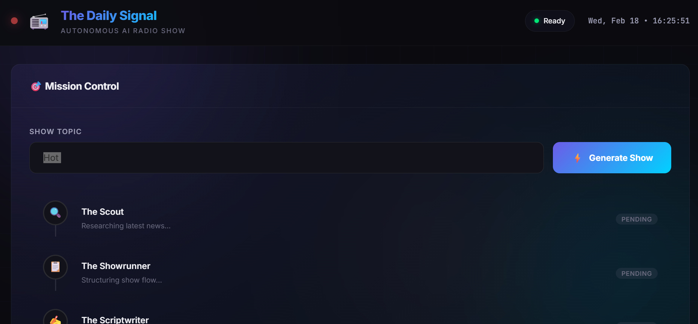

# 📻 The Daily Signal

**An autonomous AI radio show production pipeline** that generates a 3-to-5 minute daily news show with two AI hosts.

## 📺 Demo



*Premium dark-themed dashboard featuring real-time pipeline tracking, script viewer, and audio player.*

## 🎙️ Meet the Hosts

| Host | Personality | Voice |
|------|-------------|-------|
| **Alex** ⚡ | High-energy tech optimist, fast-talker, visionary | Kore |
| **Sam** 🤔 | Skeptical realist, dry wit, devil's advocate | Puck |

## ⚙️ Tech Stack

- **Orchestration**: [CrewAI](https://crewai.com) (3 sequential agents)
- **Brain**: Gemini 2.5 Flash via LiteLLM
- **Search**: Serper.dev API
- **Audio**: Gemini 2.5 Flash TTS (multispeaker)
- **Frontend**: Flask + vanilla JS dashboard

## 🚀 Quick Start

### 1. Install Dependencies

```bash
cd RadioShow
pip install -r requirements.txt
```

> **Note**: For MP3 output you also need [ffmpeg](https://ffmpeg.org/download.html) installed.

### 2. Configure API Keys

Edit the `.env` file:

```env
GEMINI_API_KEY=your_gemini_api_key_here
SERPER_API_KEY=your_serper_api_key_here
SHOW_TOPIC=Artificial Intelligence
```

- **Gemini API Key**: [Get it here](https://aistudio.google.com/apikey)
- **Serper API Key**: [Get it here](https://serper.dev/)

### 3. Run — CLI Mode

```bash
python main.py
```

### 4. Run — Web Dashboard

```bash
python app.py
```

Then open [http://localhost:5000](http://localhost:5000)

## 📁 Project Structure

```
RadioShow/
├── agents.py          # Scout, Showrunner, Scriptwriter agents
├── tasks.py           # Research, Show Flow, Script tasks
├── crew.py            # Crew assembly with memory
├── tts_generator.py   # Gemini multispeaker TTS
├── main.py            # CLI entry point
├── app.py             # Flask web server
├── .env               # API keys (edit this!)
├── requirements.txt   # Python dependencies
├── templates/
│   └── index.html     # Dashboard UI
├── static/
│   ├── css/style.css  # Premium dark theme
│   └── js/app.js      # Frontend logic
└── output/            # Generated files
    ├── show_research.txt
    ├── show_script.txt
    └── daily_show.mp3
```

## 🔄 Pipeline Flow

```
SerperDev Search → The Scout (research) → The Showrunner (structure)
                                          ↓ Human Approval
                   The Scriptwriter (dialogue) → Gemini TTS → daily_show.mp3
```

## ⚠️ Notes

- **Human-in-the-loop**: The Showrunner task will pause for your approval when running in CLI mode
- **Memory**: Agents share context via CrewAI's built-in memory (ChromaDB + SQLite)
- **Audio**: If ffmpeg isn't installed, output will be `.wav` instead of `.mp3`
